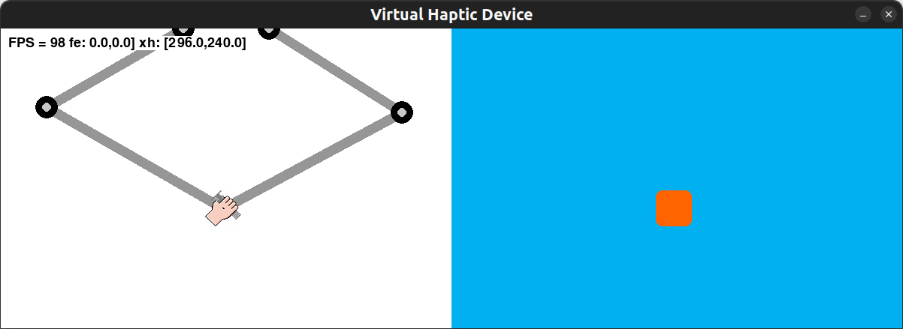
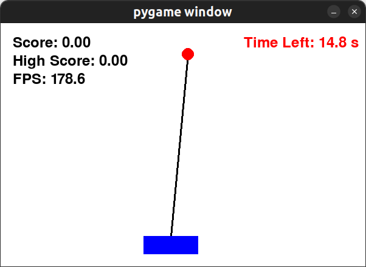

# Inverted Pendulum with MPC-Aided Haptics

## Overview
The motivation behind this project is the rehabilitation of motor skills. In this case, the inverted pendulum is used as a game, where the user moves the base of the pendulum left or right to balance the cart. 

To reduce frustration and tailor difficulty for different users, Model Predictive Control (MPC) is used to compute optimal control inputs. These control inputs are then fed back to the user through haptics. 

Alternative simpler methods were also tested, such as applying force output based on the relative angle away from vertical. However, this only guided the user in the general direction without conveying the intuition of other states. By utilizing MPC, the cost function can be fine-tuned to consider not only the pendulum's angle but also the cart's position, leading to more effective assistance.

## Requirements
This implementation requires Linux and assumes that `acados` is already set up. For installation details on `acados`, refer to their [GitHub page](https://github.com/acados/acados).

## Installation
### Setting up the virtual environment
```bash
python3 -m venv inverted_venv
source inverted_venv/bin/activate
pip install -r requirements.txt
```

### Running the simulation
In separate terminals, run the following commands:
```bash
python3 main.py
```
```bash
python3 Haptics.py
```
The simulation will work without a haptic device, but there will be no force feedback.

## Controls
- **Press 'E'** to start the game
- **Press 'M'** to toggle MPC on/off
- **Press 'R'** to restart after game over
- **Press 'Q'** to quit the game

## How It Works
- The pendulum simulation follows realistic physics and considers torque, gravity, and damping effects.
- MPC computes optimal control inputs in real time to help the user maintain balance.
- A haptic device (if available) provides feedback force to guide the user.
- Scoring is based on the angle of the pendulum and accumulated over time.

## Haptic Interface

## Game's Interface
